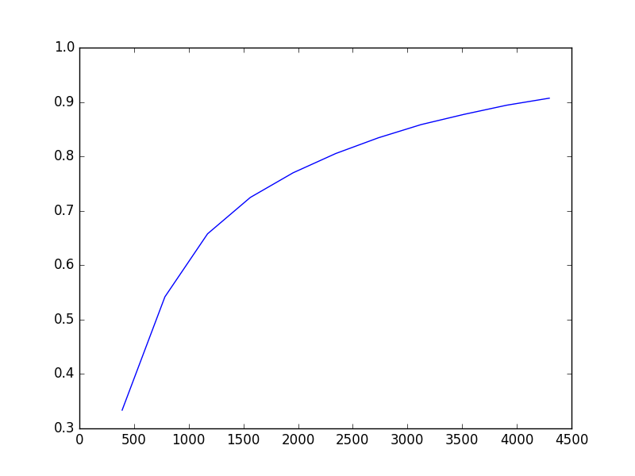
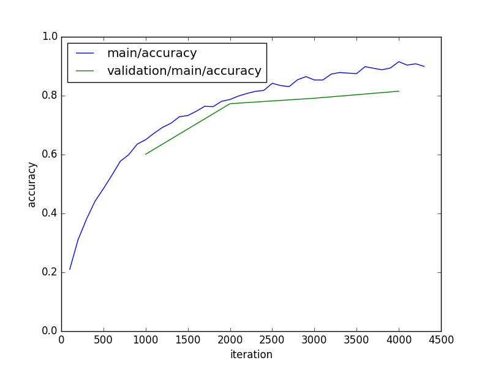

# GraphReport

[Chainer](https://github.com/pfnet/chainer) extension module to output graph such as learning-curve.

## Usage

### Minimal code

```python
trainer.extend(GraphReport('main/accuracy'))
```



### Customize graph

With using `postprocess` argument, you can customize the graph.

```python
def postprocess(figure, axes, summary):
    axes.set_xlabel('iteration')
    axes.set_ylabel('accuracy')
    axes.set_ylim((0, 1))
    axes.legend(loc='best')

trainer.extend(GraphReport(('main/accuracy', 'validation/main/accuracy'), 
                           trigger=(100, 'iteration'), 
                           postprocess=postprocess,
                           file_name='accuracy.png'))
```



## Parameter

```python
GraphReport(y_keys, x_key='iteration', trigger=(1, 'epoch'), postprocess=None, file_name='graph.png')
```

### `y_keys (str or tuple of str)`

The value regarded as y axis.
    
### `x_key (str)`

The value regarded as x axis.
    
### `trigger (tuple)`

Trigger that decides when to aggregate the result and output the values.
    
### `postprocess (Callable)`

You can specify a callback function to customize the figure. This callback function receive 3 paramters.
    
|name|type|
|---|---|
|figure|[matplotlib.Figure](http://matplotlib.org/api/figure_api.html)|
|axes|[matplotlib.Axes](http://matplotlib.org/api/axes_api.html)|
|summary|dict|
    
### `file_name (str)`

The output file name.
